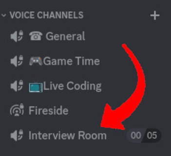

# Purpose Of This Document

We would like to thank you for agreeing to be interviewed for one of our podcasts. In preparation of your appearance on one of our shows, we would like to share this document with you as it provides answers to some of the frequent questions guests ask about being interviewed for one of the [RJJ](https://rjj-software.co.uk)-produced podcasts. Hopefully, this document will provide answers to any questions that you have and provide a little insight into the process of being interviewed for the show.

If you still have questions, please feel free to contact us and ask directly. We will likely ask for permission to include a version of your questions in the next version of this document - this is not a requirement, but we're always looking to improve this document.

Our thanks go out to those listed in the [contributors](./Contributors.md) document for their help with drafting this document.

We understand that there is a lot of information in this document, but we ask that you read through the [Generic Questions](#generic-questions) section, at least, ahead of your recording session with us. We are happy to arrange a call and discuss the points in this document ahead of the recording.

## Obtaining the Latest Document

Although we will be sure to send you the very latest version of this document, if you're unsure as to whether you have the latest version of this document, you can find a PDF version of it at the [GitHub releases page](https://github.com/jamie-taylor-rjj/Podcast-FAQs/releases).

## Generic Questions

These questions and points are related to both all of the podcasts that we produce and any any other podcasts you might appear on. As such, they are more generic than the questions which are specific to our shows.

### Equipment and Software Questions

This section contains questions which are directly related to the equipment and software that you will need in order to be a guest on one of our shows. Experienced podcasters will likely now the answers to these questions, however inexperienced podcasters or those new to podcasting may not.

#### Do I Need Any Specific Equipment?

You will need:

- a microphone
- a pair of headphones, earphones, or a form of audio monitor
- a PC, laptop, or similar
- a web browser

#### What About Software?

Our preferred method of recording podcasts is to use a Software-as-a-service webapp called [EnnuiCastr](https://ecastr.com/faq/). This is a very minimal application and doesn't require installation of any applications. Because of the simiplicity of setting up and joining a recording, we will prefer EnnuiCastr over any other method - we will send you a link to a recording session, and you need to open that link in the browser.

EnnuiCastr works similarly to other remote podcast recording applications (such as Squadcast, ZanCastr, etc.) with the exception that it focuses solely on audio recording (others provide video recording facilities as well as audio recording). As such, the user interface is a little more "bare bones" than most; because of this, the application is smaller and will require fewer system resources.

You will _not_ need an account or to pay for EnnuiCastr, as we will handle setting up and managing the recording session. You will just need to open a link in your web browser to join the recording session.

---

If, for some reasons, EnnuiCastr proves to be difficult to set up, we will fall back to using Discord and a bot called [Craig](https://craig.chat). Both EnnuiCastr and Craig record audio using the [Opus audio codec](https://en.wikipedia.org/wiki/Opus_(audio_format)) which is very high quality for very low bandwidth - meaning that it doesn't get in the way of facilitating the conversation, and uses very little bandwidth - they both also record each person's audio as a separate track, which is a necessity for the high-quality of editing that [RJJ provide as part of our podcast mastering](https://rjj-software.co.uk/podcasting-services/).

If you do not have a Discord account, we can still arrange recording using a VoIP-based service, but we will prefer to use either EnnuiCastr, or Discord and Craig where possible.

The reasons we like to use the above mentioned apps are numerous, but the two main reasons are:

- EnnuiCastr requires following a single link, and does not require installation of any software
- The proliferation of Discord throughout the gaming and software development communities
- The ease of use that Craig provides both to our guests and to our editing staff

Craig records audio using the [Opus audio codec](https://en.wikipedia.org/wiki/Opus_(audio_format)) which is rather high quality for very low bandwidth - meaning that it doesn't get in the way of facilitating the conversation, and uses very little bandwidth - and Craig also records each person's audio as a separate track, which is a necessity for the high-quality of editing that [RJJ provide as part of our podcast mastering](https://rjj-software.co.uk/podcasting-services/).

---

In previous years, we have used [SquadCast software-as-a-service platform](https://squadcast.fm/) to facilitate the recording of our podcasts. Whilst we found this service to be more stable than the majority of VoIP products (Skype, Zoom, Hangouts, etc.) we also found that it wasn't as fit for our purposes as we would like. As such, all of the RJJ-produced podcasts are now recorded via either EnnuiCastr, or Craig and Discord.

#### Web Browser & Setup

For EnnuiCastr to work at peak efficiency (and for any recording session to happen with as few issues as possible), we recommend that you ensure that you are using the latest version of your web browser of choice. Most modern web browsers update themselves, but you may have to initiate an update sequence if you run a Linux based operating system (if you're not sure whether you are running an Linux based operating system, then you probably aren't).

When it comes to browser support for EnnuiCastr, we would like to quote the [https://ecastr.com/faq/](https://ecastr.com/faq/):

> Ennuicastr works on Firefox, Chrome, Safari, and all Chromium-derived browsers including Brave and the new Edge. Any computer or phone powerful enough to run one of these browsers should be more than sufficient to use Ennuicastr

(source: [https://ecastr.com/faq/](https://ecastr.com/faq/), captured on December 5th, 2023)

### How We Record

This section contains questions which are directly related to the process and software that we use for recording episodes. We would advise the experienced podcasters take a look at [EnnuiCastr Setup](#ennuicastr-setup), and that inexperienced podcasters or those new to podcasting pay attention to the [VPNs and Tor](#vpns-and-tor) and [Software Updates](#software-updates) sections.

#### EnnuiCastr Setup

Joining an EnnuiCastr session should be a case of heading to a provided link in your web browser and giving EnnuiCastr permission to use your microphone. The format of the provided URL will be: `https://weca.st/?` followed by four groups of characters, separated with hyphens. We will provide you with this URL ahead of time.

Whe you join, you will be asked to provide a screen name, this is useful for us as it will tell us how you would like us to refer to you in the recording. This screen name will also be used as the file name for your recording, as such please consider this when providing a screen name; characters in your screen name which are not safe for file names may cause the recording to fail - if you can create a file or folder on your computer with your screen name, then it will be fine.

When everyone is ready to record, we will initiate the record. From this point onwards, the user interface will have a green theme, and all audio from your chosen microphone will be captured in your web browser.

// need a screen shot of EnnuiCastr mid-recording

EnnuiCastr uses "progressive upload", this means that it will store the audio in your browser and upload it in the background - this is one of the reasons for us asking you to disable any VPN connections (see [VPNs and Tor](#vpns-and-tor) for details).

When the recording is completed, the user interface will go back to it's default colour theme. At this point, it will be safe to disconnect if you wish.

#### Discord Setup

In order to use Discord as a recording system, you will need to join the relevant Discord server for the show you will be guesting on. These details will be sent to you as part of the email exchange that we will have prior to recording.

You will need to have joined the Discord server ahead of the proposed recording date (or the proposed pre-recording discovery call date), and will be invited to join an audio room for the duration of the call.

*The location of the recording room for [The Modern .NET Show](https://dotnetcore.show/)*

Once ready to start recording, you will hear an automated voice stating:

> RECORDING

It is vital that you do not navigate to other rooms until the recording has ended, as this will cause Discord to immediately stop recording.

When the recording session has ended, you will hear an automated voice stating:

> STOPPED RECORDING

At this point, it is safe to leave the recording room should you wish.

#### Local Recording Setup

We may ask for you to provide a local recording (aka a "double-ender"). There are many reasons for this, one reason being a potential unstable connection which could lead to a broken recording; another reason might be that you are unable to use EnnuiCastr or Discord.

In either case, there are lots of apps you can use for this, some of which ship with your operating system; such as [Sound Recorder on Windows](https://support.microsoft.com/en-us/windows/sound-recorder-app-for-windows-faq-5c208478-2141-bd07-fe1d-d6d1356c1d56), and [Garage Band on MacOS](https://apps.apple.com/us/app/garageband/id408709785). However, we would recommend something like [Audacity](https://www.audacityteam.org) as it is free and works on all major computer operating systems.

If we need ot rely on a local recording, we will likely ask to perform a "sync clap". For this, the recording host will count down from three, and everyone will need to clap on an unsaid zero. As an example:

**Host**: 3, 2, 1
**Host and Guest**: &ast;_clap_&ast;

// need a screen shot of two tracks, with sync claps, in sync
// need a screen shot of two tracks, with sync claps, out of sync

The reason for this, is that the spikes in the audio from the clap create a near-perfect visual synchronisation point. This helps the editing team at RJJ Software to ensure that all audio recordings are in sync before the start editing; which can save hours of manually tweaking the audio to synchronise everything during the edit.

#### VPNs and Tor

If you are running a VPN locally, we ask that you disable it for the recording. This is because VPNs will negatively impact the recording applications that we use to facilitate the session.

We also ask that you use a non-Tor based browser. If you are unsure whether you are using a Tor-based browser then you are probably not using one, and can ignore this advice.

We cannot, and do not, support recording sessions in which guests utilise either a VPN or Tor-based browser. We realise that this may cause issues for guests who may require these to be setup and present. If you require either a VPN or a Tor-based browser, please let us know and we will come up with an alternative way of recording the sessions.

#### Software Updates

We recommend that you disable automatic operating system updates ahead of your recording session. This is because installation of system updates in the background is a very CPU intensive task, which requires temporarily taking parts of the operating system offline, and this can lead to degraded performance or hardware stopping working.

This is only a problem on Windows based computers (and laptops), as MacOS and Linux-based operating systems tend to request permission before installing any updates (or, in the case of Linux-based operating system, require an explicit action from the user in order to install them).

We recommend that you check for system updates a few days ahead of the planned recording session and install any during a regularly scheduled update window. This will ensure that your computer is running with those updates before we record. For this reason, we tend not to book recording sessions on or directly after "[Patch Tuesday](https://en.wikipedia.org/wiki/Patch_Tuesday)"

#### How Will You Arrange The Interview?

Typically, we will arrange the interview date and time via email.

We tend to favour finding a date and time which is convenient for the person(s) we are interviewing. As such, it may take a few rounds of emailing in order to pick the most convenient time.

Once the date and time have been confirmed, we will arrange a Discord recording session and send a calendar invite to each person who will be interviewed. The calendar invite will be set for the specific date and time of the proposed recording, and will contain:

- a link to any planning documents
- a link to either an EnnuiCastr recording session or the relevant Discord server
- a link to this document

The podcast planning document will contain a link to the relevant Discord server, a link to this document, and a summary of the questions, topics, and points that we are aiming to cover in the session. Please see the [Podcast Planning Document](#podcast-planning-document) section for more details.

#### How Long Will The Interview Last?

We usually ask that guests block out 90-120 minutes of their schedule for the interview, however most interviews will take less than 90 minutes.

The reason that we ask guests to block out that much time is to ensure that we have time for a sound check and a light chat at the beginning of the session, along with a conversation about when we are planning to release the episode at the end of the session.

For details on how long recordings for each podcast will take, please see the "How Long Will The Interview Last?" question for the show that you will guest on - provided later in this document.

You are free to take as much time as you may need in order to answer a question. Similarly, if you find that you would like to start over with your answer to a question or a topic, you need only ask.

#### Podcast Planning Document

In advance of the recording session, we will send over a document which will outline the episode we wish to record with you. This document will contain:

- A link to the relevant Discord server
- A link to this document
- A collection of questions, topics, and points that we would like to discuss
- A request for a profile (if required)

This document is collaborative in nature and we ask you to feel free to edit the list of questions, topics, and points, along with anything else in the document ahead of recording. We will use this document whilst recording the episode, as an aid to memory.

### Podcasting Advice

This section contains questions adn generic advice for guests, both experienced and new. We recommend that all guests take a cursory glance at these questions, as there are points here which might be specific to our shows.

#### What If I Flub/Bungle/Botch What I Am Saying?

None of the [RJJ](https://rjj-software.co.uk) produced podcasts are live in any way, and are all edited offline. This means that, should you require more time to make a point or have any trouble saying something, you only have to request another attempt at making it, and our editing team will handle cutting out the previous attempt.

[Jamie](https://twitter.com/podcasterjay), for instance, often says:

> Let me try that again

when he flubs a sentence or falls over his words. The "better" version of the sentence is used in the final cut of the episode, and the same respect will be offered to you.

#### Advice for the Best Sounding Recording

tl;dr -> anything that you can hear will be picked up by the microphone; any seat shuffling, desk banging, eating, or other people (or pets) in the room with you. These things can be removed from the final recording, but it will substantially increase editing time. It would normally take around 90 minutes to edit a 30 minute block of audio, with extra background sounds to be edited out this will increase three to tend fold - so a 30 minute block of audio could take upwards of 900 minutes to edit.

The following simple rule is worth remembering:

> garbage audio in will equal garbage audio out

Whilst we will work to the best of our abilities when editing the recording, we ask that you take a few steps to ensure that the recording is of the highest quality possible:

- Ensure that you are in a quiet area
- Ensure that family members and/or room-mates (or anyone else you may share your house with) know that you are recording and ask them to not interrupt you
- Ensure that all un-necessary applications on your computer are closed or halted
- Please ensure that mobile/cell phones, tablets, and ancillary devices are set to "do not disturb"
- Please ensure that you are not connected to a VPN
  - If you do use a VPN, the recording may not complete correctly, rendering it effectively useless
- Please check your internet connectivity beforehand
  - We recommend using [fast.com](https://fast.com) as provided by Netflix, rather than [speedtest.net](https://www.speedtest.net)
- We may ask you to perform a "double ender":
  - This is where we will ask you to record your own audio at your end and send it over after the fact
  - This can be facilitated by installing [Audacity](https://www.audacityteam.org/) or a similar audio recording application
  - We only require your audio, so the use of [Audio Hijack](https://rogueamoeba.com/audiohijack/) (and similar applications) is not recommended
  - Once completed, we will require you to send us the recorded audio encoded in FLAC format
    - This can be done by Exporting as FLAC from within Audacity
    - Or installing [ffmpeg](https://www.ffmpeg.org/) and running the following command (assuming that you have already exported as a wave file): `ffmpeg -i input_file.wav exported_flac.flac`
      - where `inputfile.wav` is the recording that you exported from Audacity and `exported_flac.flac` is the file that you will send us
- If possible, please connect to your network via ethernet rather than WiFi
  - This can increase your available bandwidth and data transfer speed, potentially increasing the fidelity of the audio recorded
